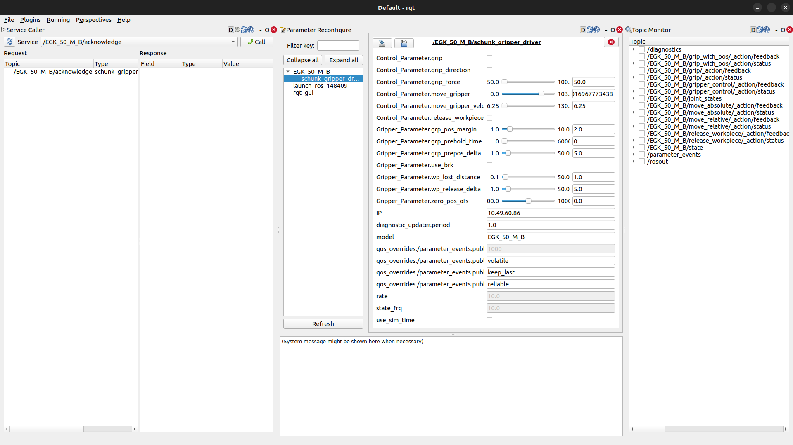

<div align="center">
  
  <h1 align="center">Schunk EGU/EGK Gripper</h1>
</div>

<p align="center">
  <a href="https://opensource.org/licenses/gpl-license">
    
  </a>
  <a href="https://github.com/SCHUNK-SE-Co-KG/schunk_egu_egk_gripper/actions">
    
  </a>
  <a href="https://github.com/SCHUNK-SE-Co-KG/schunk_egu_egk_gripper/actions">
    
  </a>
  <a href="https://github.com/SCHUNK-SE-Co-KG/schunk_egu_egk_gripper/actions">
    
  </a>
  <a href="https://github.com/SCHUNK-SE-Co-KG/schunk_egu_egk_gripper/actions">
    
  </a>
</p>


This is the official ROS2 driver for SCHUNK's
[EGU](https://schunk.com/us/en/gripping-systems/parallel-gripper/egu/c/PGR_6556),
[EGK](https://schunk.com/us/en/gripping-systems/parallel-gripper/egk/c/PGR_6557),
and [EZU](https://schunk.com/us/en/gripping-systems/centric-grippers/ezu/c/PGR_7582) grippers.
The driver communicates via the _AnybusCom 40_ interface of its internal HMS chip and is
compatible with **Ethernet**-based
versions, i.e.  _PROFINET_, _Ethernet/IP_, and _EtherCAT_.
You recognize those grippers via their two connecting cables. In contrast, the MODBUS version has only one cable and is not yet supported.

## System dependencies

We use the _curl_ library for the _HTTP_-based communication to the devices. Install that system-wide with
```bash
sudo apt install curl libcurl4-openssl-dev
```

## Build and install
Switch to the `src` folder of your current ROS2 workspace and

```bash
git clone https://github.com/SCHUNK-SE-Co-KG/schunk_egu_egk_gripper.git
sudo apt update -qq
rosdep update
rosdep install --from-paths ./ --ignore-src -y
cd ..
colcon build --symlink-install --packages-select schunk_egu_egk_gripper_driver schunk_egu_egk_gripper_library schunk_egu_egk_gripper_interfaces
```

## Getting started
First, you'll need the IP address of your EGU/EGK gripper. The grippers should ship with _DHCP_ by default.
Let's say your own IP address is `192.168.0.3`.
You can then scan your local network to find the device with
```bash
nmap -sP -A 192.168.0.1/24
```
Let's say you obtained the `192.168.0.4` for the gripper.
Now launch the driver with

```bash
source install/setup.bash
ros2 launch schunk_egu_egk_gripper_driver schunk.launch.py IP:=192.168.0.4
```
and you should be able to interact with the gripper.

You can adjust additional parameters in the driver's `schunk.launch.py` file, such as the frequencies of the `joint_states` or the `state` topics.

| topic             | parameter frequency                                  |
| ------            | ------                                               |
| state             | state_frq (1.0 Hz - ca. 60 Hz)                       |
| joint_states      | rate                                                 |

**Note:** The `state` topic will always publish the fastest rate. All other topics publish either at a slower rate or at the same rate, even if a faster rate is specified in the launch file. Actions always publish at the same rate as the `state`.

**Note:** There is also a namespace. It is recommended to set the model name as the namespace when using a single gripper. If you use multiple grippers of the same model, you can also utilize different namespaces.

### Alternative Start
The provided driver functions as a component. This implies that you can initiate the Node in the following ways:

a) Using a component manager – this process is also outlined in the launch file.

b) Within your custom executable, coupled with a (multithreaded-)executor.

If you prefer starting the node in your main function, ensure that you include `Schunk::schunk_egu_egk_gripper_driver` in CMake's `target_link_libraries()`. Additionally, always specify the IP address, setting the parameter overrides "IP" to your designated IP.

## Actions
All functionalities of the gripper, including movement, are treated as actions. This implies that when gripping, moving, or releasing a workpiece, you need to send a goal and can receive a result or feedback. Releasing a workpiece is the only action where you send an empty goal:

- `move_to_absolute_position`
- `move_to_relative_position`
- `grip`
- `grip_with_position`
- `release_workpiece`
- `gripper_control`

In contrast to the ROS1 driver, the gripping actions in ROS 2 always have the same name (`grip` and `grip_with_pos`). The ROS 2 driver still automatically recognizes the model and sets the appropriate goal based on the model.

'gripper_control' is the only action utilizing „control_msgs/action/GripperCommand“. It can be used for absolute movement (at half the maximal velocity) and gripping with or without a position. Please note that this action only supports external gripping.

## Services

Services are functionalities that do not involve movement or occur so rapidly that feedback is unnecessary. If you require more information about the gripper during such operations, it is recommended to utilize the state topic.

- `acknowledge`
- `stop`
- `fast_stop`
- `softreset`
- `parameter_get`
- `parameter_set`
- `release_for_manual_movement`
- `prepare_for_shutdown`

**Important:** During a soft reset, no topics will be published. This will last for approximately 7 seconds. Afterward, all publications resume, and you can modify parameters.

**Important:** If you use `prepare_for_shutdown`, you also need to shut down the gripper, which can be also done using a soft reset.

**Important:** To exit from `release_for_manual_movement`, you need to activate `fast_stop` and `acknowledge`.

All other services can be used whenever you like. (**Note:** Fast stop is an abort of movement, so it always provokes an error).

With `parameter_get` and `parameter_set` you can read and set all allowed Parameter of the gripper. For getting and setting you need always the parameter instance. After that

## Parameters

You can change parameter of the Gripper using dynamic reconfigure. Following parameters are available for change:

- `use_brk`
- `grp_pos_margin`
- `grp_prepos_delta`
- `zero_pos_ofs`
- `grp_prehold_time`
- `wp_release_delta`
- `wp_lost_dst`

For this type of parameter, you have to include the namespace: "GripperParameter."
Example: `GripperParameter.use_brk`

You have the option to change the default values in the `schunk.launch.py` file, which will be loaded when you start the node.

Optionally, you can perform some basic commands to the gripper via Parameter. In this case, we recommend trying out `rqt` and opening the parameter reconfigure monitor.

## Dynamic reconfiguration

We recommend using `rqt` to explore the capabilities of the gripper-driver. It lets you view all topics, dynamic reconfigure parameters, and services. You can also publish messages on topics (such as action goals) or call services. First, launch your driver as explained in [Getting started](#getting-started). Open a new terminal
```
source install/setup.bash
rqt
```
Note that `rqt` currently has limitations in getting message classes for action feedback and action goals.


Open:
- Plugins/Configuration/Dynamic Reconfigure: For changing parameters.
- Plugins/Services/Service Caller: For calling services.
- Plugins/Topic/Topic Monitor: For viewing all messages.
