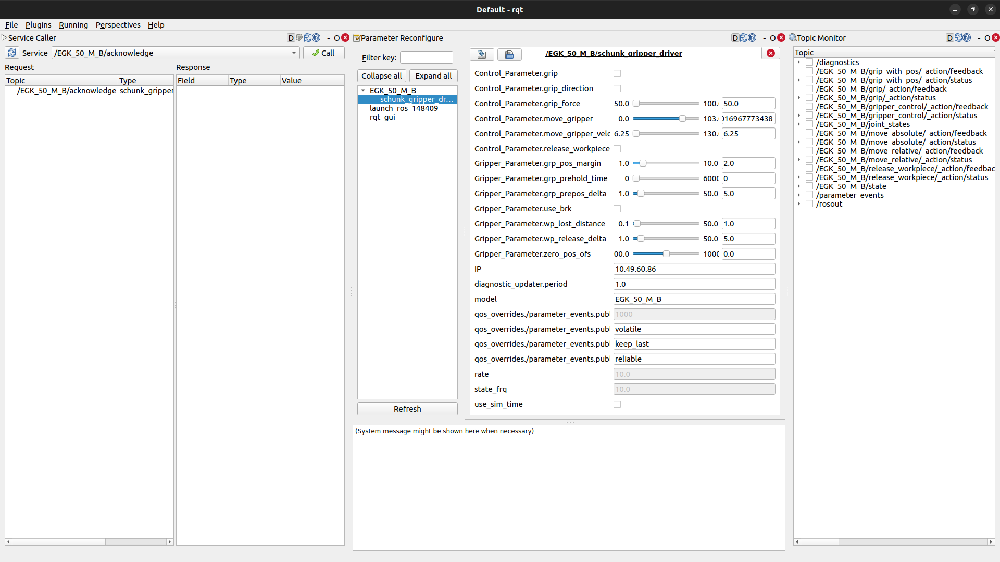

# schunk_gripper_driver


## Description

ROS2 driver for controlling Schunk EGU/EGK grippers. It is compatible with grippers featuring PROFINET, Ethernet/IP, or EtherCAT communication interfaces. The ROS driver encapsulates all gripper functionalities, excluding the jog mode.


### Background

The driver communicates with the AnybusCom 40 interface, enabling its use with PROFINET, Ethernet/IP, and EtherCAT grippers over HTTP. The ROS wrapper exposes the gripper's functionalities through ROS.

## Requirements

The provided distribution is "humble." To install ROS2 and verify compatibility with your operating system, please refer to the following link: 
[ROS2 Installation Guide](https://docs.ros.org/en/humble/Installation.html)

Following C++ libraries are required: 
- [libcurl](https://curl.se/libcurl/)
- [nlohmann/json](https://github.com/nlohmann/json)

'nlohmann/json' is included in the project. You don't need to download it separately.

## Build
Clone the GitLab repository into your workspace:
```
git clone https://gitlab-test.cloud.schunk.com/technology-factory/students/ros-gripper/ros2_schunk_driver.git
```
Now install all ros-dependencies:
```
sudo apt update -qq
rosdep update
rosdep install --from-paths src --ignore-src -y
```
Build the workspace and activate it:
```
colcon build
source install/local_setup.bash
```
## Getting started

To set up the environment for an EGU/EGK gripper, you'll need its IP address. Once obtained, you can then input it into the 'schunk_launch.py' file. (path: src/schunk_gripper/launch/schunk_launch.py) configuring it to appear as follows:
```
 parameters=[ {'IP': '10.49.60.74'} ]
```
Replace **"10.49.60.74"** with your own IP address.

Build the workspace using the following command:

```
colcon build
```

After that, you should be able to start the launch file and interact with the gripper.

In the launch file, you can also adjust the frequencies of the 'joint_states', 'state', and 'diagnostics' topics.

| topic             | parameter frequency                                  |
| ------            | ------                                               |
| state             | state_frq (1.0 Hz - ca. 60 Hz)                       |
| joint_states      | rate                                                 |
| diagnostics       | diagnostics_period (**Note:** Period, not frequency) |

**Note:** The 'state' topic will always publish the fastest rate. All other topics publish either at a slower rate or at the same rate, even if a faster rate is specified in the launch file. Actions always publish at the same rate as the 'state'.

**Note:** There is also a namespace. It is recommended to set the model name as the namespace when using a single gripper. If you use multiple grippers of the same model, you can also utilize different namespaces.

### Alternative Start
The provided driver functions as a component. This implies that you can initiate the Node in the following ways:

a) Using a component manager – this process is also outlined in the launch file.

b) Within your custom executable, coupled with a (multithreaded-)executor.

If you prefer starting the node in your main function, ensure that you include "schunk_gripper_driver" in the cmake target_link_libraries. Additionally, always specify the IP address, setting the parameter overrides for "IP" to your designated IP. Alternatively, create the "SchunkGripperNode"-Component and utilize the "reconnect" service, specifying your IP.

# ROS-Node
This section demonstrates the capabilities of the driver and provides instructions on how to utilize it. The node is a ROS2 component.

## Actions
All functionalities of the gripper, including movement, are treated as actions. This implies that when gripping, moving, or releasing a workpiece, you need to send a goal and can receive a result or feedback. Releasing a workpiece is the only action where you send an empty goal:

- `move_to_absolute_position`
- `move_to_relative_position`
- `grip`
- `grip_with_position`
- `release_workpiece`
- `gripper_control`

In contrast to the ROS1 driver, the gripping actions in ROS 2 always have the same name (`grip` and `grip_with_pos`). The ROS 2 driver still automatically recognizes the model and sets the appropriate goal based on the model.

'gripper_control' is the only action utilizing „control_msgs/action/GripperCommand“. It can be used for absolute movement (at half the maximal velocity) and gripping with or without a position. Please note that this action only supports external gripping.

## Services

Services are functionalities that do not involve movement or occur so rapidly that feedback is unnecessary. If you require more information about the gripper during such operations, it is recommended to utilize the state topic.

- `acknowledge`
- `stop`
- `fast_stop`
- `softreset`
- `parameter_get`
- `parameter_set`
- `reconnect`
- `release_for_manual_movement`
- `prepare_for_shutdown`
- `gripper_info`

**Important:** During a soft reset, no topics will be published. This will last for approximately 7 seconds. Afterward, all publications resume, and you can modify parameters.

**Important:** If you use `prepare_for_shutdown`, you also need to shut down the gripper, which can be also done using a soft reset.

**Important:** To exit from `release_for_manual_movement`, you need to activate `fast_stop` and `acknowledge`.

All other services can be used whenever you like. (**Note:** Fast stop is an abort of movement, so it always provokes an error).

`gripper_info` publishes some information about the gripper on the terminal screen.

`reconnect` is the only method for altering the IP address during runtime. If nothing is connected to the IP address or a gripper is connected, it undergoes a change. If something else is linked to this IP, errors will occur, and the old address will be retained in such cases. Exercise caution when using this service!

With `parameter_get` and `parameter_set` you can read and set all allowed Parameter of the gripper. For getting and setting you need always the parameter instance. After that 

## Parameter

You can change parameter of the Gripper using dynamic reconfigure. Following parameters are available for change:

- `use_brk`
- `grp_pos_margin`
- `grp_prepos_delta`
- `zero_pos_ofs`
- `grp_prehold_time`
- `wp_release_delta`
- `wp_lost_dst`

For this type of parameter, you have to include the namespace: "GripperParameter."
Example: `GripperParameter.use_brk`

You have the option to change the default values in the `schunk_launch.py` file, which will be loaded when you start the node.

Optionally, you can perform some basic commands to the gripper via Parameter. In this case, we recommend trying out rqt and opening the parameter reconfigure Monitor. (Note: It may not function optimally in ROS 2; if that's the case, we recommend using the terminal instead)

## Example

To explore the capabilities of the gripper-driver, we recommend using rqt. There, you can view all topics, dynamic reconfigure parameters, and services. You can also publish messages on topics (such as action goals) or call services. To launch rqt with the node, use the schunk_rqt_launch.py:
```
ros2 launch schunk_gripper schunk_rqt_launch.py
```
Alternatively, you can launch schunk.launch and open the rqt tool separately:
```
ros2 launch schunk_gripper schunk_launch.py
rqt
```
It is known that rqt can not get the message class for action feedback and action goals.


Open:
- Plugins/Configuration/Dynamic Reconfigure: For changing parameters.
- Plugins/Services/Service Caller: For calling services.
- Plugins/Topic/Topic Monitor: For viewing all messages.

Additionally, you can refer to 'gripper_example.cpp' for guidance on using this driver in your code. To run the example, start 'schunk_launch.py' (or 'schunk_rqt_launch.py') and then execute the example:  
**!!!WARNING!!! This will move the gripper jaws**
```
ros2 run schunk_gripper schunk_example
```