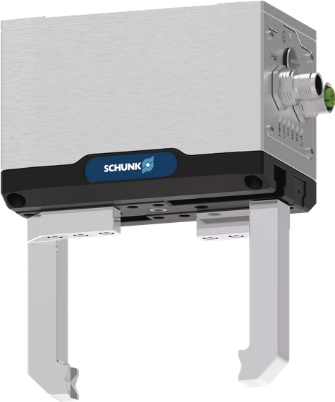

<div align="center">
  
  <h1 align="center">SCHUNK Gripper</h1>
</div>

<p align="center">
  <a href="https://opensource.org/licenses/gpl-license">
    
  </a>
  <a href="https://github.com/SCHUNK-SE-Co-KG/schunk_egu_egk_gripper/actions">
    
  </a>
  <a href="https://github.com/SCHUNK-SE-Co-KG/schunk_egu_egk_gripper/actions">
    
  </a>
</p>

**Update**: There's a new version upcoming 🚀! Please use the [develop](https://github.com/SCHUNK-SE-Co-KG/schunk_egu_egk_gripper/tree/develop) branch for latest features. We have been reworking this driver completely. More info in this [pull request](https://github.com/SCHUNK-SE-Co-KG/schunk_egu_egk_gripper/pull/13).

---


This is the ROS2 driver for SCHUNK's
[EGU](https://schunk.com/us/en/gripping-systems/parallel-gripper/egu/c/PGR_6556),
[EGK](https://schunk.com/us/en/gripping-systems/parallel-gripper/egk/c/PGR_6557),
and [EZU](https://schunk.com/us/en/gripping-systems/centric-grippers/ezu/c/PGR_7387) mechatronic grippers.
The driver supports both _Modbus RTU_ and _Ethernet_-based (_PROFINET_, _Ethernet/IP_, and _EtherCAT_) versions.


## Under construction
We are currently doing a complete rework of this driver in Python.
A _beta_ release is planned for end of May '25.

## Build and install
In a new terminal, source your global ROS2 environment, e.g.
```bash
source /opt/ros/humble/setup.bash
```
navigate into your local ROS2 workspace, and build the driver with
```bash
git clone -b develop https://github.com/SCHUNK-SE-Co-KG/schunk_egu_egk_gripper.git src/schunk_gripper
sudo apt update -qq
rosdep update
rosdep install --from-paths src --ignore-src -y
colcon build
```

## Getting started
Source your local ROS2 workspace with
```bash
source install/setup.bash
```
and start the driver with
```bash
ros2 launch schunk_gripper_driver driver.launch.py
```
