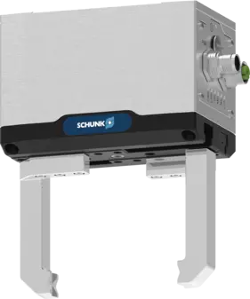
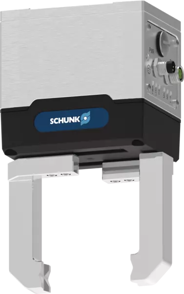
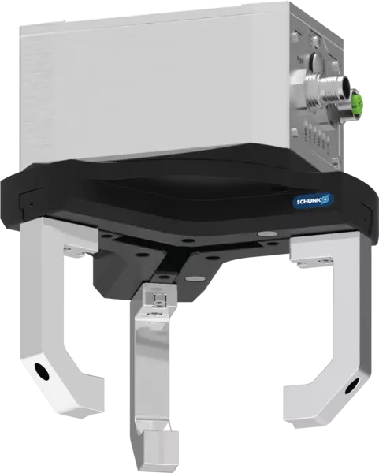

  
  &nbsp;&nbsp;&nbsp;&nbsp;&nbsp;&nbsp;&nbsp;&nbsp;&nbsp;&nbsp;&nbsp;
  
  &nbsp;&nbsp;&nbsp;&nbsp;&nbsp;&nbsp;&nbsp;&nbsp;&nbsp;&nbsp;&nbsp;
  

<h1 align="center">SCHUNK Gripper</h1>

  
  
  

The **SCHUNK Gripper ROS2 Driver** provides full functionality for controlling SCHUNK mechatronic grippers:

- [EGU](https://schunk.com/us/en/gripping-systems/parallel-gripper/egu/c/PGR_6556) – universal gripper
- [EGK](https://schunk.com/us/en/gripping-systems/parallel-gripper/egk/c/PGR_6557) – gripper for small components
- [EZU](https://schunk.com/us/en/gripping-systems/centric-grippers/ezu/c/PGR_7387) – centric gripper

**Supported interfaces:** Ethernet/IP, Modbus RTU, Profinet and EtherCAT (EoE)

## Quickstart

>### 📦 Installation
>Start by setting up the driver and dependencies.  
>Supports both native installation and Docker setup.  
>[Open documentation →](./docs/installation.md)

>### 🚀 Launching
>Learn how to launch the driver in different modes.  
>[Open documentation →](./docs/launching.md)

>### 📡 Topics & Services
>Full API reference for all driver interactions.  
>[Open documentation →](./docs/topics_and_services.md)

>### 💡 Examples
>Practical usage examples for different launch modes.  
>[Open documentation →](./docs/examples.md)

>### 🧪 Testing
>Run automated checks and verify driver functionality.  
>[Open documentation →](./docs/testing.md)

## Overview

The SCHUNK Gripper ROS2 driver provides an interface to control SCHUNK mechatronic grippers.
The driver architecture consists of:

- **Gripper Library** – handles low-level communication and abstracts the protocol details for each gripper variant.
- **ROS2 Node** – exposes topics and services to read the gripper state and send commands.
- **Interfaces** - a collection of message and service definitions to interact with the grippers.

The driver can **automatically detect connected grippers** and supports **handling multiple grippers simultaneously** within a single ROS2 node, with each gripper running in a separate ROS2 namespace.

### Lifecycle Management

The driver node follows the standard [ROS2 lifecycle](https://design.ros2.org/articles/node_lifecycle.html) conventions. **All grippers managed by a single driver node share the same lifecycle state**. The available states are `unconfigured`, `inactive`, `active`, and `finalized`.

The driver supports two launch modes:

- **Normal mode:** The driver starts in the `unconfigured` state. Transitions are **manual** and must be triggered via service calls from an external client.
- **Headless mode:** The driver automatically connects to previously saved grippers and transitions to the `active` state after startup.

All services and topics are bound to the lifecycle state and are only available when the driver (and all connected grippers) is in the appropriate state. For example:
- Grippers can only be added or scanned in the `unconfigured` state.
- Grip commands can only be issued when the node is `active`.

## Topics and Services

The driver exposes topics and services to retrieve the gripper state and parameters, and to issue commands such as gripping, moving, jogging, or releasing.
All topics and services are **namespaced per gripper** and are advertised only when the driver is in the appropriate lifecycle state (e.g., `active`).
All service names are consistent across all supported gripper types; however, some underlying service types differ because certain gripper types support different execution modes.

A full list of available endpoints and their lifecycle availability can be found here: [docs/topics_and_services.md](./docs/topics_and_services.md)

## Connecting to Grippers

The driver starts in the `unconfigured` lifecycle state. In this state, it provides services to scan the network for available grippers and to add them to the driver.
 
Once the driver has transitioned into the `active` lifecycle state, each added gripper can be accessed and controlled through its assigned namespace.

It is also possible to locate connected grippers by triggering a twitch of their fingers via a service call. This is useful in scenarios where you need to identify which physical gripper corresponds to which connection.

### Auto-Connect

Grippers that have been added to the driver can be saved to a configuration file via a service call. This configuration file can be loaded either via a service call or a launch argument, allowing the driver to automatically connect to all previously saved grippers. If a saved gripper is not physically available at runtime, its corresponding services will still be published, but calling them will result in no-ops.

## Contributing

Contributions are welcome! Please see the full guidelines in our [CONTRIBUTING.md](CONTRIBUTING.md) before opening a pull request.

## License

This project is licensed under the **GPLv3 License**. See the [LICENSE](LICENSE) file for details.
